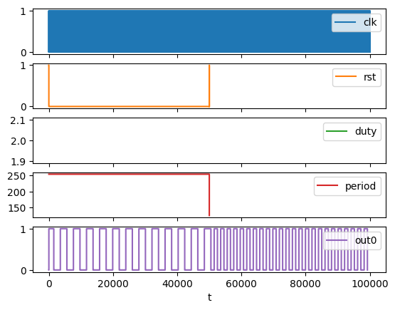

  

# XLS APU Pulse Oscillator

Attempt at recreating the square oscillator from the NES [APU](https://www.nesdev.org/wiki/APU_Pulse) with [XLS](https://google.github.io/xls/) for [TinyTapeout 3.5](https://github.com/TinyTapeout/tinytapeout-03p5).

 for building and simulating the design.

*Note: Currently just implement the base oscillator frequency and duty cycle control, the other 4 oscillators are each tuned on different octave.*

## Simulation

## Chip preview

[3D viewer](https://gds-viewer.tinytapeout.com/?model=https://proppy.github.io/tt03p5-xls-apu/tinytapeout.gds.gltf)

## Resources

* [XLS: Accelerated HW Synthesis](https://google.github.io/xls/)
* [APU Pulse](https://www.nesdev.org/wiki/APU_Pulse)
* [FAQ](https://tinytapeout.com/faq/)
* [Digital design lessons](https://tinytapeout.com/digital_design/)
* [Learn how semiconductors work](https://tinytapeout.com/siliwiz/)
* [Join the community](https://discord.gg/rPK2nSjxy8)
